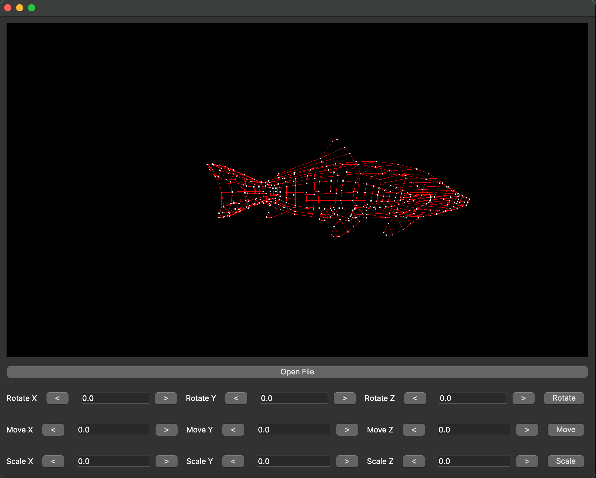
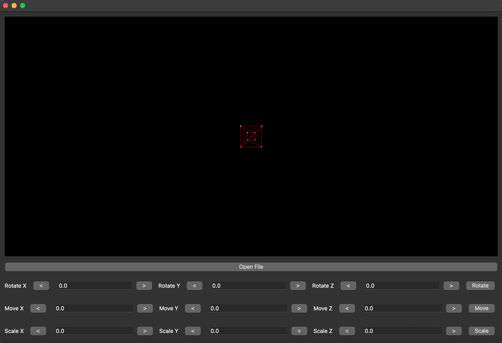

# 3D Model Viewer (OpenGL)

Этот проект представляет собой 3D модельный просмотрщик с использованием OpenGL и Qt для создания пользовательского интерфейса. Программа позволяет загружать 3D-модели в формате `.obj`, а также управлять трансформациями моделей, такими как перемещение, поворот и масштабирование. Также реализованы функции взаимодействия с камерой, такие как поворот и приближение/отдаление.

## Описание

### Поворот камеры

Поворот камеры осуществляется с помощью мыши. Для этого достаточно щелкнуть и удерживать левую кнопку мыши, чтобы перемещать камеру вокруг модели. Это позволяет изменять угол обзора, улучшая взаимодействие с 3D-моделью.

### Приближение и отдаление

Для изменения масштаба сцены можно использовать комбинации клавиш:
- **Command +** для приближения.
- **Command -** для отдаления.

Эти клавиши позволяют увеличить или уменьшить изображение модели в окне, изменяя ее видимость в зависимости от потребностей пользователя.

## Описание функциональности трансформаций

- **Scale (Масштабирование)**:
  Масштабирование модели позволяет изменить размер объекта по осям X, Y и Z. Это полезно, если необходимо уменьшить или увеличить модель для лучшего отображения или анализа.

- **Move (Перемещение)**:
  Функция перемещения позволяет переместить модель вдоль осей X, Y и Z. Это используется для сдвига модели в 3D-пространстве.

- **Rotate (Поворот)**:
  Поворот модели позволяет вращать объект вокруг осей X, Y и Z. Это важно для просмотра объекта с разных углов и ориентаций.

## Текущий статус проекта

На данный момент проект находится на стадии разработки, и это не окончательная версия.

## Структура кода

### Главное окно (MainWindow)

В главном окне (`MainWindow`) создается интерфейс для управления моделями. Основные элементы управления:
- Кнопка загрузки файла для открытия модели.
- Поля ввода для значений трансформаций (перемещение, поворот, масштабирование).
- Кнопки для изменения значений трансформаций (прибавить/убавить).
- Кнопка для применения трансформаций.

### Трансформации

- **`move()`** — управляет перемещением модели.
- **`rotate()`** — управляет поворотом модели.
- **`scale()`** — управляет масштабированием модели.

Каждая из этих функций работает с полями ввода для осей X, Y, Z и применяет соответствующие изменения к модели.

